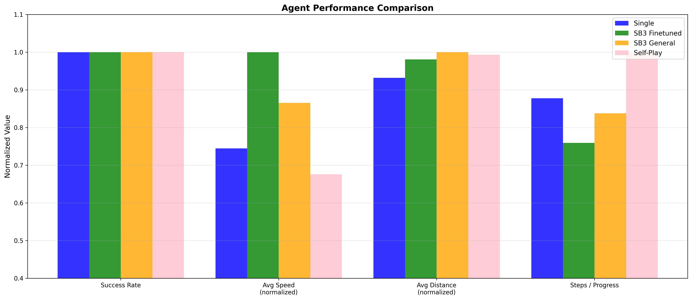
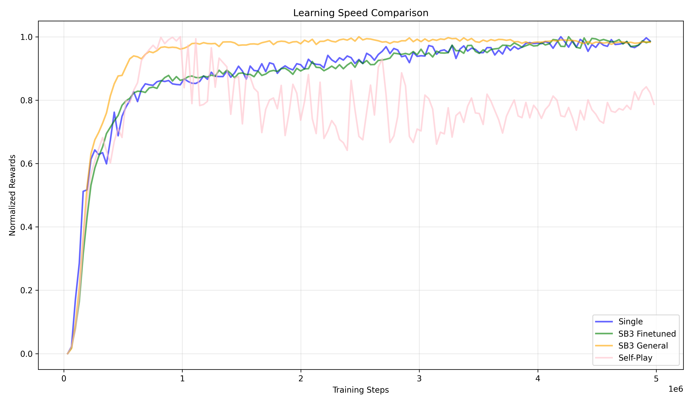

# Multi-Agent Racing with Self-Play Reinforcement Learning

A 'from scratch' implementation of a self-playing PPO and Gymnasium environment, compared against single-agent PPO (from scratch and SB3).

## Project Overview

This project showcases a complete RL pipeline from environment design to multi-agent training, featuring:

- **Custom racing environment** built from scratch using Gymnasium
- **PPO implementation** from scratch 
- **Self-play training** where agents learn to race competitively against past versions of themselves
- **Multi-agent dynamics** with collision detection and competitive reward structures

https://github.com/user-attachments/assets/6e7963f1-34c4-4d83-b6cc-06ab8ca47f73

## 📊 Results



**Performance Metrics (Successful Runs Only):**
- **Success Rate**: % of races completed
- **Average Speed**: Racing velocity in successful runs
- **Average Distance**: Total path length (lower = tighter racing line)

**Efficiency Metrics (All Runs, Including Crashes):**
- **Steps/Progress**: Time efficiency (lower = faster completion)
- **Distance/Progress**: Path efficiency (lower = optimal racing line)



## Architecture

### Environment Design

**Observation Space (19,):**
- 11 raycasted distance sensors (180° front cone)
- Forward/lateral velocity, angular velocity, steering angle
- 4 relative features per opponent (position & velocity in local frame)

**Action Space (2,):**
- Steering: [-1, 1] (full left to full right)
- Throttle: [0, 1] (no acceleration to full throttle)

### PPO Implementation

**Key Features:**
- Generalized Advantage Estimation (GAE)
- Learning rate annealing
- Log-std annealing for exploration → exploitation
- Gradient clipping and advantage normalization
- KL divergence early stopping

### Self-Play Training

**Algorithm:**
1. Train agent vs random opponent (updates 1-15)
2. Create snapshot every 15 updates
3. Maintain opponent pool (max 5 snapshots)
4. Each rollout samples random opponent from pool

## Installation
```bash
# Clone repository
git clone https://github.com/yourusername/racing-self-play
cd racing-self-play

# Create virtual environment
python -m venv venv
source venv/bin/activate  # On Windows: venv\Scripts\activate

# Install dependencies
pip install -r requirements.txt
```

## Project Structure
```
├── agent/
│   ├── ppo.py              # PPO implementation from scratch
│   └── self_play_ppo.py    # Self-play wrapper with opponent pool
├── configs/
│   ├── base_config.py      # Base hyperparameters
│   └── self_play_config.py # Self-play specific config
├── environment/
│   ├── car.py              # Vehicle physics
│   ├── multi_car.py        # Multi-agent car handling
│   ├── multi_racing_env.py # Multi-agent racing environment
│   ├── multi_track.py      # Multi-agent track handling
│   ├── racing_env.py       # Single-agent racing environment
│   ├── track.py            # Procedural track generation & boundary logic
│   └── wrappers.py         # Self-play opponent wrapper
├── utils/
│   ├── metrics.py          # Evaluation metrics
│   └── visualization.py    # Racing visualization & video generation
├── static/                 # Generated visualizations & metrics
├── train.py                # Training script
├── evaluate.py             # Evaluation script
└── README.md
```

## References

- [Proximal Policy Optimization](https://arxiv.org/abs/1707.06347) - Schulman et al. 2017
- [Emergent Complexity via Multi-Agent Competition](https://arxiv.org/abs/1710.03748) - Bansal et al. 2017
- [Mastering Atari with Self-Play](https://arxiv.org/abs/1809.09988) - OpenAI Five
- [Stable Baselines3 Documentation](https://stable-baselines3.readthedocs.io/)
- [Hugging Face DRL](https://huggingface.co/learn/deep-rl-course/en/unit8/introduction)

## License

MIT License
